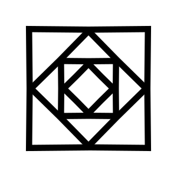

<p align="center"></p>
<h1 align="center">star-icon-tag</h1>
<p align="center">
  <a href="https://riotjs.com">
    
  </a>
  <a href="https://travis-ci.org/nhz-io/star-icon-tag">
    
  </a>
</p>
<h3 align="center">Make SVG Stars</h3>

## Install

```sh
$ npm i -D star-icon-tag
```

## Usage
```html
<star-icon fill="orange" />
```

```js
import 'star-icon-tag'
...
riot.mount('star-icon')
```

### Tag Properties

* #### layers
  Number of overlapping star layers.  
  *Default: `1`*

* #### fill
  Star fill color  
  *Default: `#555`*

* #### arms
  Number of star arms  
  *Default: `5`*

* #### ratio
  Inner points radius / Outer points radius ratio  
  *Default: `0.6`*

* #### rotation
  Rotation angle in degrees
  *Default: `0`*

* #### zoom
  Inner points radius / Outer points radius ratio  
  *Default: `0.6`*

`fill`, `arms`, `ratio`, `rotation` and `zoom` can be either a single value
or a comma-separated list of values for each layer. If the count of values
does not match the number of layers, the list is trimmed or propagated with
the first value.


## Examples

### Header star
 |
  ```html
  <star-icon layers="6"
    fill="brown, orange ,yellow,  brown, orange, yellow"
    ratio="0.55, 0.5, 0.44, 0.55, 0.5, 0.44"
    rotation="0, 0, 0, 36, 36, 36"
    zoom="1, 0.95, 0.9, 0.50, 0.45, 0.4" />
  ```

### Compass

  ```html
  <star-icon layers="8"
    arms="4"
    fill="black, white ,black,  white, black, #eee, black, #eee"
    ratio="0.16, 0.12, 0.16, 0.12, 0.16, 0.12, 0.16, 0.12"
    rotation="-22.5, -22.5, 22.5, 22.5, 0, 0, 45, 45"
    zoom="0.8, 0.75, 0.8, 0.75, 1, 0.95, 1, 0.95" />
  ```

### Red

    ```html
    <star-icon layers="3"
      arms="5"
      fill="red, white, red"
      ratio="0.8, 0.6, 0.4"
      zoom="1, 0.95, 0.95" />
    ```

### Squares

  ```html
  <star-icon layers="8"
    arms="4"
    fill="black, white, black, white, black, white, black, white"
    ratio="0.7, 0.7, 0.7, 0.7, 0.7, 0.7, 0.7"
    zoom="1, 0.9, 0.7, 0.6, 0.49, 0.39, 0.33, 0.23"
    rotation="45, 45, 0, 0, 45, 45, 0, 0, 45, 45, 0, 0" />
  ```

## License

MIT © [Ishi Ruy](https://nhz.io/star-icon-tag)
